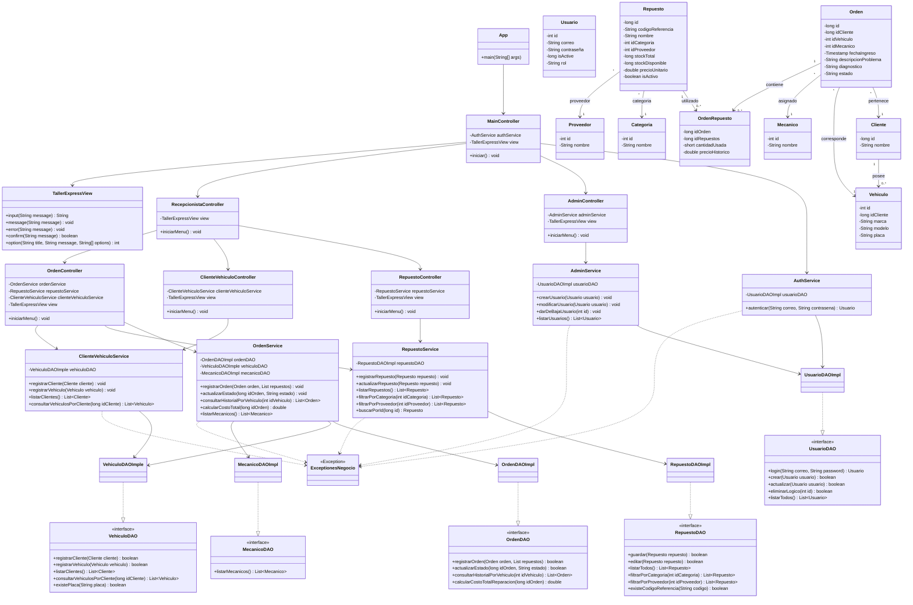
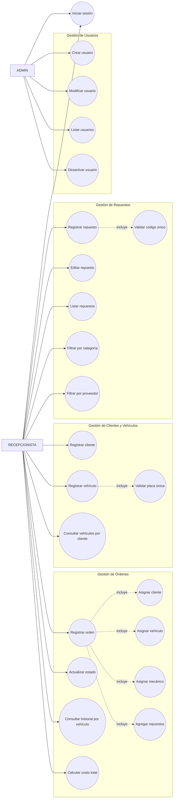
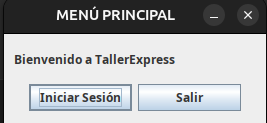
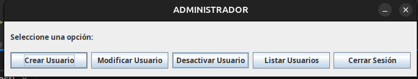
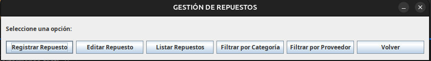
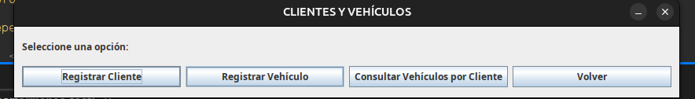
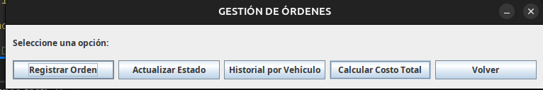

# java-performance-test

Sistema interno para la gestión de un taller mecánico desarrollado en **Java SE**, utilizando **JOptionPane** como interfaz gráfica, **JDBC** para la conexión con **PostgreSQL** y una arquitectura organizada por capas.

El sistema permite administrar usuarios, repuestos, clientes, vehículos y órdenes de servicio, aplicando validaciones de negocio, excepciones personalizadas y transacciones JDBC.

---

## Descripción general

TallerExpress busca centralizar la información relacionada con las operaciones principales de un taller mecánico.

El sistema permite:

- Iniciar sesión según el rol del usuario.
- Gestionar usuarios.
- Registrar y actualizar repuestos.
- Consultar y filtrar repuestos.
- Registrar clientes.
- Asociar uno o varios vehículos a un cliente.
- Validar placas únicas.
- Registrar órdenes de servicio.
- Asociar repuestos utilizados a una orden.
- Actualizar el estado de una orden.
- Consultar el historial de servicios de un vehículo.
- Calcular el costo total de una reparación.
- Actualizar el inventario mediante transacciones JDBC.

---

## Tecnologías utilizadas

- Java 21
- Java SE
- Maven
- PostgreSQL
- JDBC
- JOptionPane
- Git
- GitHub
- NetBeans / IDE compatible con Maven

---

## Arquitectura del proyecto

El proyecto utiliza una arquitectura por capas:

```text
App
 │
 ▼
Controller
 │
 ▼
Service
 │
 ▼
DAO
 │
 ▼
PostgreSQL
```

Cada capa tiene una responsabilidad específica.

### Controller

Se encarga de:

- Recibir las acciones del usuario.
- Mostrar menús mediante JOptionPane.
- Recibir información ingresada.
- Limpiar datos con métodos como `trim()`.
- Convertir datos cuando sea necesario.
- Controlar la navegación entre módulos.
- Capturar excepciones y mostrar mensajes al usuario.

Ejemplos:

```text
MainController
AdminController
RecepcionistaController
RepuestoController
ClienteVehiculoController
OrdenController
```

### Service

Contiene las reglas de negocio del sistema.

Ejemplos:

- Validar que un código de repuesto no esté repetido.
- Validar que una placa sea única.
- Verificar que el stock no sea negativo.
- Validar el estado de una orden.
- Validar que un vehículo pertenezca al cliente seleccionado.
- Lanzar excepciones de negocio cuando una operación no es válida.

### DAO

Se encarga exclusivamente del acceso a la base de datos utilizando JDBC.

Ejemplos de operaciones:

```sql
SELECT
INSERT
UPDATE
DELETE
```

Los DAO utilizan:

- `Connection`
- `PreparedStatement`
- `ResultSet`
- `try-with-resources`

### Model

Contiene las clases que representan las entidades principales del sistema.

Entre ellas:

```text
Usuario
Cliente
Vehiculo
Repuesto
Orden
Categoria
Proveedor
Mecanico
OrdenRepuesto
```

---

## Estructura del proyecto

```text
src/main/java
│
├── controller
│   ├── MainController.java
│   ├── AdminController.java
│   ├── RecepcionistaController.java
│   ├── RepuestoController.java
│   ├── ClienteVehiculoController.java
│   └── OrdenController.java
│
├── service
│   ├── AuthService.java
│   ├── AdminService.java
│   ├── RepuestoService.java
│   ├── ClienteVehiculoService.java
│   └── OrdenService.java
│
├── dao
│   ├── UsuarioDAO.java
│   ├── RepuestoDAO.java
│   ├── VehiculoDAO.java
│   ├── OrdenDAO.java
│   └── MecanicoDAO.java
│
├── dao.impl
│   ├── UsuarioDAOImpl.java
│   ├── RepuestoDAOImpl.java
│   ├── VehiculoDAOImple.java
│   ├── OrdenDAOImpl.java
│   └── MecanicoDAOImpl.java
│
├── model
│   ├── Usuario.java
│   ├── Cliente.java
│   ├── Vehiculo.java
│   ├── Repuesto.java
│   └── Orden.java
│
├── model.aux
│   ├── Categoria.java
│   ├── Proveedor.java
│   ├── Mecanico.java
│   └── OrdenRepuesto.java
│
├── exception
│   └── ExceptionesNegocio.java
│
├── config
│   └── DatabaseConnection.java
│
├── view
│   └── TallerExpressView.java
│
└── App.java
```

---

## Roles del sistema

### ADMIN

El administrador puede gestionar los usuarios del sistema.

Funciones:

- Crear usuarios.
- Modificar usuarios.
- Listar usuarios.
- Desactivar usuarios.
- Iniciar y cerrar sesión.

### RECEPCIONISTA

El recepcionista tiene acceso a los módulos operativos del taller.

#### Gestión de repuestos

- Registrar repuestos.
- Editar repuestos.
- Listar repuestos.
- Filtrar por categoría.
- Filtrar por proveedor.
- Validar código de referencia único.
- Controlar stock disponible.

#### Gestión de clientes y vehículos

- Registrar clientes.
- Registrar vehículos.
- Asociar vehículos a clientes.
- Validar placa única.
- Consultar vehículos registrados por cliente.

#### Gestión de órdenes

- Registrar órdenes de servicio.
- Seleccionar cliente.
- Seleccionar vehículo.
- Seleccionar mecánico.
- Registrar descripción del problema.
- Registrar diagnóstico.
- Asociar repuestos utilizados.
- Actualizar el estado de la orden.
- Consultar historial por vehículo.
- Calcular costo total de reparación.

---

## Inicio de sesión

El sistema valida:

- Correo.
- Contraseña.
- Estado activo del usuario.
- Rol.

Flujo general:

```text
App
 ↓
MainController
 ↓
AuthService
 ↓
UsuarioDAO
 ↓
PostgreSQL
```

Si las credenciales son correctas, el sistema obtiene el rol del usuario.

```text
ADMIN
 ↓
AdminController
```

o

```text
RECEPCIONISTA
 ↓
RecepcionistaController
```

---

## Base de datos

El proyecto utiliza PostgreSQL.

Base utilizada:

```text
taller_express
```

Tablas principales:

```text
Usuarios
Clientes
Vehiculos
Repuestos
Categorias
Proveedores
Mecanicos
Ordenes
orden_repuestos
```

La tabla `orden_repuestos` permite representar la relación de muchos a muchos entre las órdenes de servicio y los repuestos utilizados.

---

## Configuración de PostgreSQL

Crear una base de datos:

```sql
CREATE DATABASE taller_express;
```

Después se deben ejecutar los scripts correspondientes a la creación de tablas del proyecto.

La conexión JDBC debe configurarse en:

```text
config/DatabaseConnection.java
```

Ejemplo:

```java
private static final String URL = "jdbc:postgresql://localhost:5432/taller_express";
private static final String USER = "postgres";
private static final String PASSWORD = "tu_contraseña";
```

Cambiar el usuario y contraseña según la configuración local de PostgreSQL.

---

## Driver JDBC

El proyecto utiliza Maven para administrar las dependencias.

En el archivo `pom.xml` se incluye el driver de PostgreSQL:

```xml
<dependencies>
    <dependency>
        <groupId>org.postgresql</groupId>
        <artifactId>postgresql</artifactId>
        <version>42.7.7</version>
    </dependency>
</dependencies>
```

---

## Usuario administrador inicial

Para crear un usuario administrador de prueba se puede ejecutar:

```sql
INSERT INTO Usuarios (correo, contrasena, is_active, rol)
VALUES ('admin', 'admin', 1, 'ADMIN');
```

Datos para iniciar sesión:

```text
Correo: admin
Contraseña: admin
```

> Estas credenciales son únicamente para pruebas académicas.

---

## Excepciones personalizadas

El proyecto utiliza una excepción personalizada:

```text
ExceptionesNegocio
```

Ejemplo:

```java
if (repuestoDAO.existeCodigoReferencia(repuesto.getCodigoReferencia())) {
    throw new ExceptionesNegocio("El código de referencia ya está registrado.");
}
```

El Controller captura la excepción:

```java
catch (ExceptionesNegocio e) {
    view.error(e.getMessage());
}
```

De esta manera las reglas se mantienen dentro del `Service`, mientras el `Controller` se encarga de mostrar el mensaje correspondiente.

---

## Validaciones de negocio

El sistema implementa validaciones como:

- Código de referencia de repuesto único.
- Placa de vehículo única.
- Stock mayor o igual a cero.
- Stock disponible no superior al stock total.
- Precio del repuesto válido.
- Cliente válido.
- Vehículo registrado.
- Vehículo perteneciente al cliente seleccionado.
- Mecánico existente.
- Estado de orden válido.
- Usuario activo para iniciar sesión.
- Credenciales obligatorias.

---

## Estados de una orden

Los estados manejados por el sistema son:

```text
PENDIENTE
REPARANDO
TERMINADO
```

Antes de actualizar una orden, el `Service` valida que el estado enviado corresponda a uno de los valores permitidos.

---

## Transacciones JDBC

El registro de una orden utiliza una transacción JDBC.

Flujo:

```text
setAutoCommit(false)
        ↓
Registrar orden
        ↓
Descontar stock
        ↓
Registrar repuestos utilizados
        ↓
commit()
```

Si ocurre un error:

```text
Error
 ↓
rollback()
```

Esto evita que se registre una orden incompleta o que se descuente inventario sin que la operación completa haya terminado correctamente.

---

## Trazabilidad mediante consola

Las operaciones realizadas mediante JDBC generan mensajes en consola simulando llamadas HTTP.

Ejemplos:

```text
[HTTP POST] -> /api/repuestos
[HTTP GET] -> /api/repuestos
[HTTP PUT] -> /api/repuestos/1
[HTTP PATCH] -> /api/ordenes/1/estado
[HTTP RESPONSE 200 OK]
[HTTP RESPONSE 201 Created]
[HTTP RESPONSE 400 Bad Request]
[HTTP RESPONSE 500 Internal Server Error]
```

---

## Interfaz gráfica

Toda la interacción principal con el usuario se realiza mediante `JOptionPane`.

Se utilizan principalmente:

```java
JOptionPane.showInputDialog()
JOptionPane.showMessageDialog()
JOptionPane.showConfirmDialog()
JOptionPane.showOptionDialog()
```

Para centralizar estas operaciones se creó:

```text
TallerExpressView
```

---

## Ejecución del proyecto

### Requisitos previos

Tener instalado:

- Java 17 o superior.
- Java 21 recomendado.
- Maven.
- PostgreSQL.
- Git.
- IDE compatible con proyectos Maven.

### Paso 1 - Clonar el repositorio

```bash
git clone URL_DEL_REPOSITORIO
```

Entrar al proyecto:

```bash
cd java-performance-test
```

### Paso 2 - Crear la base de datos

En PostgreSQL:

```sql
CREATE DATABASE taller_express;
```

Ejecutar posteriormente el script de creación de tablas.

### Paso 3 - Configurar conexión

Modificar:

```text
DatabaseConnection.java
```

con los datos locales:

```java
jdbc:postgresql://localhost:5432/taller_express
```

Usuario y contraseña de PostgreSQL.

### Paso 4 - Descargar dependencias

Con Maven:

```bash
mvn clean install
```

También puede ejecutarse desde el IDE utilizando:

```text
Clean and Build
```

### Paso 5 - Ejecutar

Ejecutar:

```text
App.java
```

La aplicación mostrará el menú principal mediante `JOptionPane`.

---

## Flujo principal

```text
APP
 │
 ▼
LOGIN
 │
 ├───────────────┐
 ▼               ▼
ADMIN       RECEPCIONISTA
 │               │
 ▼               ├── Repuestos
Usuarios         ├── Clientes/Vehículos
                 └── Órdenes
```

---

## Diagrama de clases

El siguiente diagrama representa la estructura principal del proyecto y las relaciones entre las capas `Controller`, `Service`, `DAO` y `Model`.



---

## Diagrama de casos de uso

El sistema maneja dos actores principales: **ADMIN** y **RECEPCIONISTA**.



### Resumen de actores

**ADMIN**

- Iniciar sesión.
- Crear usuarios.
- Modificar usuarios.
- Listar usuarios.
- Desactivar usuarios.

**RECEPCIONISTA**

- Iniciar sesión.
- Registrar, editar, listar y filtrar repuestos.
- Registrar clientes y vehículos.
- Consultar vehículos asociados a un cliente.
- Registrar órdenes de servicio.
- Asociar repuestos a una orden.
- Actualizar el estado de una orden.
- Consultar historial de servicios por vehículo.
- Calcular el costo total de la reparación.

---

## Capturas de pantalla

### Inicio de sesión



### Menú Administrador



### Gestión de Repuestos



### Gestión de Clientes y Vehículos



### Gestión de Órdenes


```

---

## Principios de POO aplicados

### Encapsulamiento

Los atributos de los modelos son privados y se accede a ellos mediante getters y setters cuando corresponde.

### Abstracción

Las interfaces DAO definen las operaciones necesarias sin exponer directamente su implementación JDBC.

### Polimorfismo

Las implementaciones DAO cumplen los contratos definidos mediante sus interfaces.

Ejemplo:

```java
public class RepuestoDAOImpl implements RepuestoDAO {
}
```

### Modularidad

Cada clase mantiene una responsabilidad específica dentro de la arquitectura.

---

## Criterios implementados

### Repuestos

- [x] Registrar repuestos.
- [x] Editar repuestos.
- [x] Validar código único.
- [x] Listar repuestos.
- [x] Filtrar por categoría.
- [x] Filtrar por proveedor.
- [x] Validar stock.

### Clientes y vehículos

- [x] Registrar clientes.
- [x] Registrar vehículos.
- [x] Asociar vehículos a clientes.
- [x] Validar placas únicas.
- [x] Consultar vehículos por cliente.

### Usuarios

- [x] Login.
- [x] Manejo de roles.
- [x] Crear usuarios.
- [x] Modificar usuarios.
- [x] Listar usuarios.
- [x] Desactivar usuarios.

### Órdenes

- [x] Registrar órdenes.
- [x] Asignar cliente.
- [x] Asignar vehículo.
- [x] Asignar mecánico.
- [x] Registrar diagnóstico.
- [x] Registrar repuestos utilizados.
- [x] Actualizar estado.
- [x] Consultar historial.
- [x] Calcular costo.
- [x] Manejar transacciones durante el registro.

---

## Pendientes por verificar

Los siguientes requisitos del enunciado deben revisarse en la versión final del proyecto antes de marcarlos como completados:

- Decorador sobre `create` para agregar valores por defecto.
- `createdAt` para usuarios si se incorpora al modelo y a la base de datos.
- Activar/desactivar repuestos si aún no existe la operación específica.
- Validación explícita de cliente activo, si la tabla `Clientes` incorpora estado.
- Transacción específica para finalización de una orden con costo final.

---

## Datos del Coder

**Nombre:** Cristian Ronaldo Albor Parra
**Clan:** Puerta de Oro
**Correo:** calborparra@gmail.com
**Documento:** 1042853297

---

## Repositorio

Repositorio público de GitHub:

```text
https://github.com/crapdev/java-performance-test.git
```

---

## TallerExpress

Prueba de desempeño desarrollada utilizando Java SE, JDBC, PostgreSQL, JOptionPane, arquitectura por capas, Programación Orientada a Objetos, excepciones personalizadas y transacciones.
